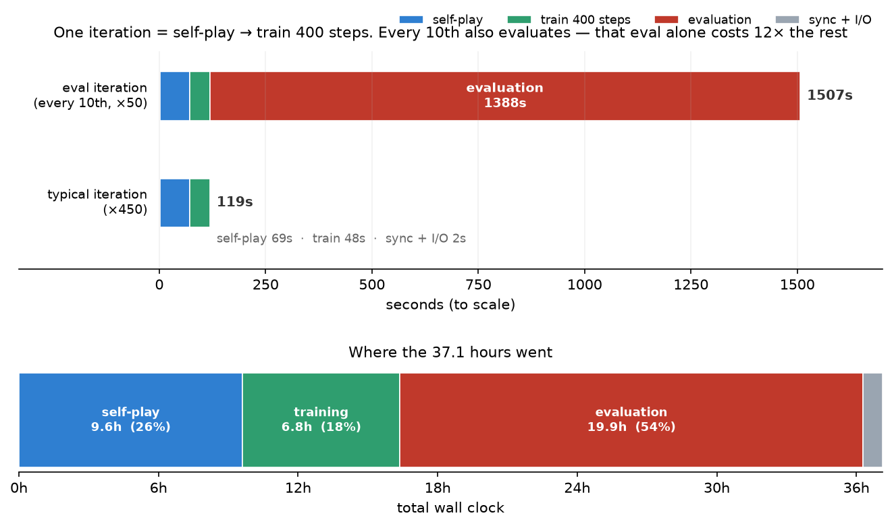
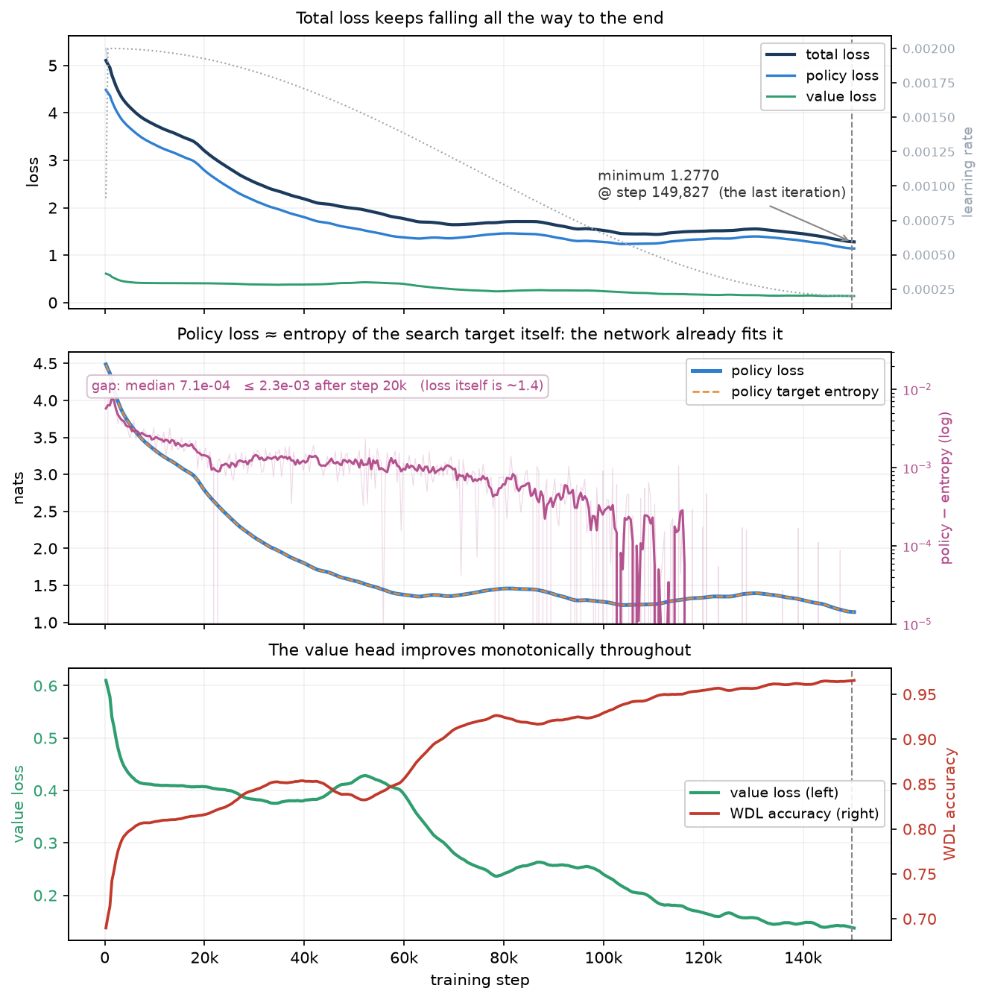
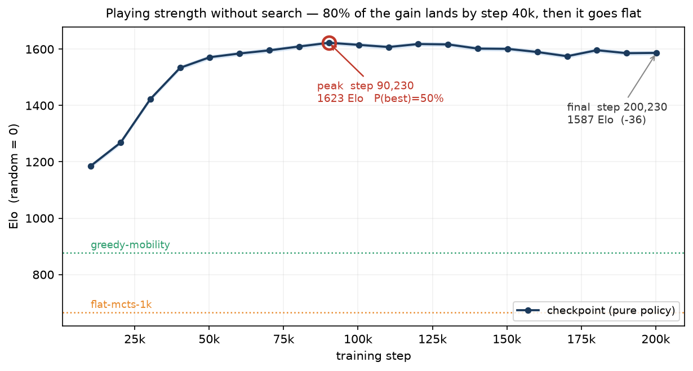

# Cornerstone：Blokus Duo 自博弈模型（BF16）训练报告

## 摘要

从零规则出发、不使用任何人类棋谱，训练出一个 14.2M 参数的 Blokus Duo 自博弈模型。

| | |
|---|---|
| 网络 | CornerNet，自研结构，14.2M 参数（D=256，16 个 block） |
| 训练方法 | Gumbel AlphaZero 自博弈，每手 64 次模拟 |
| 精度 | bf16 计算权重 + **fp32 主权重** + bf16 梯度 + fp32 优化器动量（见 [§2.5](#25-参数量与精度)） |
| 规模 | **150,227 步 / 376 轮 / 796,729 局自博弈 / 1.54 亿个训练局面** |
| 墙钟 | **4.42 小时**（4×GB200，每卡一个工作进程，训练走 DDP） |
| 棋力 | **带 64 模拟**（网络实际被使用的配置）下**终点档最强**；**纯策略**下最强 1522.6 Elo（步 120,227，锚定 `random = 0`），比最强规则基线 `greedy-mobility` 高 +698。两种口径给出不同的最强档，见 [§6.4](#64-最后一档不是最强的--但这只在纯策略口径下成立) |

四条主要结论：

1. **「纯策略下 80% 处见顶」是量尺造成的假象。** 15 档 checkpoint 与 5 个规则基线
   全对全（190 对 / 76,000 局）联合拟合后，纯策略下最强的是 **步 120,227**，
   终点比它低 **18.9 ± 9.5** 分。但把顶尖 8 档改成**带 64 模拟**重打一遍
   （36 对 / 14,400 局），**终点档反而是最强的**（比 120,227 高 10.9 ± 12.0，
   比 90,227 高 82.4），同一对的直接头对头从 0.527 翻成 0.485。
   网络实际就是带搜索用的，所以**没有「训练越久越差」这回事** ——
   纯策略把价值头整个丢掉，而后期的进步主要存在那里。详见
   [§6.4](#64-最后一档不是最强的--但这只在纯策略口径下成立)。
   **83% 的增长在前 4 万步（训练量的 27%）就拿到了**，这一条两种口径都成立。
2. **训练期的标量指标全程说谎。** 总损失在第 149,827 步取到全程最低 1.2770、
   终点 1.2805，value loss 单调降、WDL 准确率单调升 —— 三个指标一路向好。
   而真实棋力在纯策略口径下是退的、在带搜索口径下是涨的：**同一批指标同时
   「解释」了两个相反的事实，也就是它什么都没解释**。
   选 checkpoint 只能靠头对头。见 [§7.1](#71-loss-与棋力脱钩)。
3. **自博弈分布塌缩。** 先手胜率从 0.562 单调涨到 **0.965**，和局率掉到 0.006。
   0.966 的 WDL 准确率是「猜先手赢」就能拿到的分数，信息量很低。
   见 [§7.2](#72-自博弈分布塌缩)。
4. **执行架构的代价被量化了。** 每卡一个工作进程 + DDP（梯度用 bf16 `all_reduce`）
   换来 1.54× 的墙钟，代价是 **−7.8 Elo [−10.7, −4.8]**（90,000 局跨架构对局实测）。
   这是一笔明确的、可复算的交易，不是「没有影响」。见 [§7.3](#73-执行架构值多少)。

> **口径**：§6.1–§6.3 是**纯策略**（每手只做一次前向，落 `argmax(prior)`，
> 不做搜索）—— 它量的是**先验单独有多强**。§6.4 另外给了**带 64 模拟**的那张表，
> 那才是网络实际被使用的配置。
>
> **两者不是「同一件事的粗测与精测」，而是两个不同的量，而且会给出相反的排名**
> （纯策略说终点比峰值低 18.9，带搜索说终点最强）。两张表都不能单独当成
> 「这个模型有多强」，更不能拼接。要选权重、要对外声称棋力，以带搜索那张为准。

---

## 1. 任务与约束

### 1.1 规则

Blokus Duo，两人对弈：

- 棋盘 14×14 = 196 格
- 每方 21 枚多联骨牌（1~5 格），合计 **89 格**
- 起始格 (4,4) 与 (9,9)，首手必须盖住自己的起始格
- 之后每一手必须与己方已有棋子**恰好角接触**，且**不得边接触**
- 无处可下即停手；双方都停手则终局
- **占格多者胜，相同为和局**

### 1.2 四条硬约束

| 约束 | 推出的结论 |
|---|---|
| 不使用棋谱 | 只能自博弈强化学习。连**评测基线**也必须由规则构造 |
| 不复用开源 Blokus AI 结构 | 网络结构自研 |
| 低精度混合训练 | 结构要把算力集中在大 GEMM 上，低精度的收益才吃得到 |
| 压满 CPU 与 GPU | CPU 跑搜索与着法生成，GPU 跑批量推理与训练 |

### 1.3 动作空间

21 枚棋子按「4 旋转 × 2 镜像」展开去重后恰好 **91 个不同朝向**（生成时断言这个数）。
动作编码为 `朝向 × 196 + 包围盒左上角格号`，于是动作空间是

```
91 × 196 = 17,836
```

这个数字直接决定了后面几个设计：策略头的形状、稀疏策略目标的存法、
以及为什么要用 Gumbel-AZ 而不是原版 PUCT。

---

## 2. 模型结构：CornerNet

### 2.1 为什么不是卷积 ResNet

常见的开源 Blokus/围棋类实现是卷积 ResNet。本项目不能复用，也不想复用：
结构要围绕「**FLOPs 尽量集中在大 GEMM 上**」来设计 ——
低精度矩阵乘的收益只在 GEMM 上，卷积吃不到。

最终的形态是「把 196 个格子当成 196 个 token」的 Transformer 变体，
局部性由一层深度可分离卷积提供（几乎不耗算力），算力主体是 SwiGLU 的两个大 GEMM。

### 2.2 输入

| | 形状 | 内容 |
|---|---|---|
| 平面 | 9 × 14 × 14 | 己方占格、对方占格、己方可落区、己方角点前沿、对方可落区、对方角点前沿、己方起始格、对方起始格、全 1 |
| 标量 | 44 | 21 位己方剩余棋子 + 21 位对方剩余 + 己方占格/89 + 对方占格/89 |

两点值得说：

- **一切都是「行棋方视角」**，不是「先手视角」。这样座位交换类的对称增广才成立。
- **标量里放的是占格数，不是手数 ply。** 这不是随手选的：`rot180` 与反对角变换
  会把己方起始格映射到另一个座位的起始格，而 ply 的奇偶性和座位绑定 ——
  用 ply 会让这两个增广产生分布外样本。占格数是座位无关的。

### 2.3 主干

```
stem:  Conv2d(9 → D, 3×3)  →  展平成 (B, 196, D)
       + 学习式位置嵌入 (1, 196, D)
       + 标量 MLP(44 → D → D) 广播加到每个 token

PolyBlock × 16（pre-norm 残差，全部 RMSNorm）：
       x = x + DepthwiseConv5×5(RMSNorm(x))      空间混合，FLOPs 占比 <2%
       x = x + Attention(RMSNorm(x))             每 4 个 block 一次，196 token 全局注意力
       x = x + SwiGLU(RMSNorm(x))                通道混合，D → 4D → D，算力主体

norm_out: RMSNorm(D)
```

`D=256, blocks=16, attn_every=4, heads=8, dw_kernel=5`。注意力落在第 4/8/12/16 个
block（共 4 层），无 mask、无 RoPE —— 196 个格子之间是全连接的双向注意力，
位置信息完全由那个学习式嵌入提供。没有 dropout、没有 layer-scale、没有 stochastic depth。

**零拷贝的双视图。** 张量全程保持 `(B, 196, D)` 连续布局，而一个连续的
`(B, 196, D)` 在物理上就是 channels_last 的 `(B, D, 14, 14)`，所以

```python
xc = x.view(B, 14, 14, D).permute(0, 3, 1, 2)     # 纯视图，data_ptr 不变
y  = conv(xc)                                      # cuDNN channels_last 快路径
back = y.permute(0, 2, 3, 1).reshape(B, 196, D)    # 纯视图
```

两边都不产生拷贝。不注意这点的话，每个 block 要来回两次 200MB 级的转置，
16 个 block 就是 6GB 的无谓搬运。有单测拿 `data_ptr()` 守着这条性质。

### 2.4 三个输出头

| 头 | 结构 | 语义 |
|---|---|---|
| 策略 | `Linear(D → 91)` 逐 token | 转置展平成 `朝向×196 + 格号`，直接对上引擎的动作编码 |
| 价值 | `Linear(2D → D) → SiLU → Linear(D → 3)` | **WDL 三分类**，行棋方视角 |
| 辅助 | `Linear(2D → D) → SiLU → Linear(D → 1)` | 终局占格差 / 89 的回归 |

后两个头的池化是 `concat(mean_pool, max_pool)`，所以输入是 2D。

**价值头为什么是三分类而不是 tanh 标量**：本项目和局是真实且不罕见的结果
（随机对局下 4.5%），tanh 标量没法区分「这是和棋局面」和「胜负各半的混沌局面」。
MCTS 回传时用 `P(胜) − P(负)`。

**策略头零初始化**：`policy.weight` 和 `bias` 都初始化为 0，于是训练第一步的先验
就是**合法着法上的均匀分布**。不这么做，MCTS 一开始就被一个随机的强先验带偏，
自博弈数据质量会差很多。

**合法性 mask 不在模型里。** 网络输出未经掩码的 17836 维 logits，
由三个调用方各自施加：训练走 `masked_log_softmax`，自博弈交给 C++
（在合法子集上做 softmax），推理用 `mask_logits()` 填 `-inf`。

### 2.5 参数量与精度

`D=256, blocks=16` 时 **14,183,007 ≈ 14.2M**。

| 部件 | 参数量 | 占比 |
|---|---:|---:|
| SwiGLU（16 层 × 12D²） | 12,582,912 | 88.72% |
| 注意力投影（4 层 × 4D²） | 1,048,576 | 7.39% |
| 价值头 | 132,099 | 0.93% |
| 辅助头 | 131,585 | 0.93% |
| 深度卷积（16 层 × 5×5） | 106,496 | 0.75% |
| 标量 MLP | 77,312 | 0.55% |
| 位置嵌入 | 50,176 | 0.35% |
| 策略头 | 23,387 | 0.16% |
| stem 卷积 | 20,992 | 0.15% |
| 各 RMSNorm | 9,472 | 0.07% |
| **合计** | **14,183,007** | **100.00%** |

**96.1% 的参数落在大 GEMM 上**（SwiGLU + 注意力投影）—— 这正是 §2.1 那条设计取向的
直接结果。

精度方案按《低精度训练精度速查表》执行，逐项是：

| 项 | 精度 | 说明 |
|---|---|---|
| 模型参数（**计算权重**） | **bf16** | 前向/反向 GEMM 直接吃这份，不再每次从 fp32 转 |
| **主权重 master** | **fp32** | 由优化器持有，是真正被更新的那份 |
| 激活 / 残差流 | bf16 | RMSNorm 内部仍在 fp32 上算方差 |
| 梯度 | bf16 | 拷进 fp32 master 的 `.grad` 后再裁剪 |
| 梯度裁剪、参数更新 | fp32 | 在 master 上做 |
| 优化器一阶/二阶动量 | fp32 | |
| 损失 | fp32 | 策略是 17836 类的 log_softmax，bf16 尾数不够 |

**fp32 主权重不是形式主义，在本项目自己的超参上量得到。**
取实测量级的权重 0.17，用恒定梯度连更 400 步：

| 学习率 | 每步更新 | 有 fp32 master | 无 master（bf16 直更） |
|---|---|---:|---:|
| 2e-3（峰值） | 2.05 ulp | 99.9% | 112.1% |
| **2e-4（退火终点）** | **0.20 ulp** | **100.2%** | **0.1%** |

`min_lr_ratio=0.1`，2e-4 就是本项目余弦退火的终点学习率。**在那里，没有 fp32
master 的话更新几乎被完整吞掉** —— 小于半个 ULP 的增量在 bf16 上会被舍回原值。
`tests/test_optim.py` 拿这 1000 倍的分离度当判据。

**代价要说清楚：这套方案不省显存。** 每参数 16 字节（bf16 计算权重 2 +
fp32 master 4 + fp32 m/v 8 + bf16 梯度 2），checkpoint 162.5 MiB。
买到的是数值正确性，不是显存也不是吞吐。

---

## 3. 训练方法

### 3.1 Gumbel AlphaZero

用 Gumbel-AZ 而不是原版 AlphaZero，是被 Blokus 的形状逼出来的：动作空间 17836，
单步合法着法常有几百个（**开局就有 414 个**）。原版靠 PUCT + Dirichlet 噪声探索，
在这种宽度下要很大的模拟数才能让根节点的访问分布有统计意义。
Gumbel-AZ 在根节点用 Gumbel top-k 采样出 m 个候选、再用 sequential halving 分配预算，
**低模拟数下的策略改进有理论保证**。

实现要点：

- 根节点：`g_a + log π(a)` 取 top-m（`max_considered=16`）作为候选；
  轮末按 `g_a + log π(a) + σ(q_a)` 砍掉一半
- 内部节点：`argmax_a [ improved_π(a) − N(a)/(1+ΣN) ]`，
  `improved_π = softmax(log π + σ(completed_q))`，未访问动作的 q 用 `v_mix` 补全
- **回传符号不能按深度奇偶定**。Blokus 有停手规则，同一方可能连走两手，
  所以每个节点存自己的行棋方，回传时按实际行棋方定符号

### 3.2 执行架构：每卡一个工作进程

父进程只做协调（replay buffer、采样、拼 metrics、学习率、checkpoint），
**4 个对等的工作进程各占一张卡，自博弈和训练都在里面做**。

为什么是进程不是线程 —— 这是实测逼出来的。同进程多线程时自博弈在多卡上不扩展，
换成每卡一进程后线性扩展回来：

| | 1 卡 | 2 卡 | 4 卡 |
|---|---:|---:|---:|
| 每卡一进程 | 43,659 | 82,809 | **172,557 评估/s（3.95×）** |
| 同进程多线程（BF16，4 卡） | | | 164,470 → 187,856（换进程后 1.14×） |

排查时排除了三个更省事的解释，记下来免得再走一遍：**不是编译粒度**
（按 block 编 47k vs 整个 block 循环编成一个区 38k，改了更差）、**不是
`fp8_autocast` 上下文的进出开销**（提到驱动层仍是 1.01×）、**也不是 dynamo 的
重编译上限**（抬到 256 之后吞吐一点没变）。剩下的解释是同进程内的争用。

**训练也放进工作进程，走数据并行。** 修掉自博弈之后训练成了大头，而训练时另外三张卡
全闲着。数据并行在这里是**数学等价**而不是近似：三个损失分量都以 `.mean()` 收尾，
所以「4 份 256 的梯度取平均」严格等于「1 份 1024 的梯度」（实测两条路径的 loss
相对差 1.0e-05）。单卡步时 batch 1024 是 73.2 ms、batch 256 是 30.4 ms，
4 卡 DDP 约 2.4×（不到 4× 是因为模型太瘦，batch 256 就触到核函数启动的地板）。

**梯度归约用 bf16 `all_reduce`。** 速查表要求「规约在 fp32 上做」，指的是
*累加精度*，没有规定通信 dtype；NCCL 的 bf16 `all_reduce` 在 GB200 上内部就是
fp32 累加。这条偏离的端到端代价见 [§7.3](#73-执行架构值多少)，
**结论绑在 world=4 上** —— bf16 累加的误差随卡数增长。

三条容易写错的地方（都在 `pool.py` 的注释里留了记号）：

1. **工作进程必须常驻。** `torch.compile` 首次编译几十秒，每轮重启的话编译比干活还久。
2. **跨进程的 CUDA 操作没有隐式顺序。** 父进程写完权重缓冲必须 `synchronize`
   再发命令，否则工作进程可能读到写了一半的权重 —— 这种错不报错，
   只会让自博弈悄悄用错版本的网络。
3. **集合通信里任一 rank 出错，其余会卡在 `all_reduce` 上死等。** 所以工作进程
   捕获异常后要立刻把回溯发回父进程，父进程等回包时同时盯着进程存活。

还有一条语义反转，写错就会毁掉训练：**权重的真身在工作进程里**，
父进程持有的只是镜像。用工作池之后 `sync_weights()` 是空操作 ——
再从父进程往下推就是拿陈旧权重覆盖掉刚训出来的结果，而且不报错，
只表现为「怎么训都不涨棋力」。

### 3.3 自博弈：多局并行，单局单叶子

每个工作进程同时开 1024 局，**每局在任意时刻只有一个待评估的叶子**。
批量大小来自局数，不是单局内的并行叶子数。这样：

- 不需要 virtual loss（单局内不会有并发的搜索路径）
- 不需要多线程回调 Python（Python 驱动循环，C++ 只做树的工作）

驱动循环就三行：

```python
while True:
    n = engine.prepare(planes, scalars)   # C++，已释放 GIL
    if n: engine.feed(*model(planes[:n], scalars[:n]))
    else: games += engine.advance()
```

每个工作进程内再用 8 个引擎线程把树搜索摊到多核上（着法生成与树操作是 CPU 侧的
主要开销）。**推理用的就是训练那份 bf16 计算权重**，不是 fp32 master ——
否则推理和训练看到的是差一次舍入的两个模型。

### 3.4 训练目标的存法：稀疏 top-K + 尾部质量

策略目标**不做归一化**，存 top-32 的原始概率外加一个 `rest_prob`。

这不是省事，是必须的。实测训练早期 `rest_prob ≈ 0.90` —— 先验接近均匀、
合法着法几百个时，top-32 只装了约 10% 的概率质量。若把 top-32 归一化当目标，
等于在教网络集中到一组**本质上任意**的着法上。

训练时把 `rest_prob` 均摊到其余合法着法上：

```
loss_policy = -( Σ_top p_a·log q_a  +  rest_prob · mean_{a∈legal\top} log q_a )
```

一个隐蔽的坑：补位槽的概率是 0，但**动作编号必须仍指向合法着法**，
否则 gather 会取到 `-inf`，再乘 0 就是 NaN。代码里用第 0 个（一定合法）的动作填充。

### 3.5 Replay buffer：只存着法序列

一局约 30 手，每手 32 个 `(int32 动作, fp32 概率)` ≈ 260B，加着法本身约 **7 KB/局**。
稠密策略目标是每手 17836 个 float = 71 KB/**手** —— 差三个数量级。

局面特征在取批时由 C++ `build_batch` 从着法序列**重建**。CPU 有 144 核，
用算力换存储是划算的。容量 3,000,000 个局面，**第 18,227 步（第 46 轮）起一直是满的**。

### 3.6 对称增广：克莱因四元群

```
恒等        (r,c) → (r,c)
转置        (r,c) → (c,r)            两个起始格都不动
旋转 180°   (r,c) → (13-r,13-c)      两个起始格互换
反对角      (r,c) → (13-c,13-r)      两个起始格互换
```

**不是完整的 D4（8 个元素）** —— 起始格集合 {(4,4),(9,9)} 只被这四个变换保持。
旋转 180° 和反对角会交换座位，这之所以合法，正是因为特征是行棋方视角、
且标量用的是占格数而非 ply（见 §2.2）。

增广在取批时做，每次抽样独立随机选一个变换，所以同一个局面在不同 epoch 会
看到不同的对称形态。

### 3.7 损失与优化

```
loss = policy + 1.0 × value + 0.25 × score(辅助头)
```

- 价值：普通交叉熵，三分类，无 label smoothing
- 辅助：`smooth_l1(beta=0.1)`，目标是终局占格差 / 89

优化器是 `MasterWeightAdamW`（继承 `torch.optim.AdamW`，把 fp32 master 当作它的
params），`betas=(0.9, 0.95)`，`eps=1e-8`，`weight_decay=0.01`
**只加在矩阵和卷积核上**（norm、bias、位置嵌入都不加）。`grad_clip=1.0`，
裁剪在 fp32 master 的梯度上做。

学习率：线性 warmup 500 步到 `2e-3`，然后余弦退火到 `2e-4`（`0.1×`）。

**按数据量限流**（`steps_for_iteration()`）：buffer 还小的时候不许跑满 400 步，
上限是 `len(buffer) × 4 / batch_size`。不加这条的话，等于在少量局面上反复训练几十遍 ——
loss 会明显变好看，但那是坏了。**全程只在第 1 轮生效过一次**。

### 3.8 完整超参

| 组 | 参数 | 值 |
|---|---|---|
| 模型 | dim / blocks / attn_every / heads | 256 / 16 / 4 / 8 |
| | param_dtype / fp8 | bf16 / false |
| 自博弈 | parallel_games / games_per_iter | 4096（4 卡各 1024）/ 2048 |
| | simulations / max_considered / temperature_plies | 64 / 16 / 12 |
| | engine_threads_per_gpu / selfplay_devices | 8 / cuda:0-3 |
| 优化 | batch_size / steps_per_iter | 1024（4 卡各 256，DDP）/ 400 |
| | lr / warmup / total_steps / min_lr_ratio | 2e-3 / 500 / 150000 / 0.1 |
| | weight_decay / grad_clip | 0.01 / 1.0 |
| | w_value / w_score | 1.0 / 0.25 |
| Replay | capacity / min_positions / max_epochs_per_iter | 3,000,000 / 20,000 / 4.0 |
| | seed | 1 |

`torch.compile` 全程开启（BF16 走整模型编译）。**训练循环里没有周期性评测** ——
规则基线量不了这个网络，理由见 [§5.2](#52-为什么训练循环里没有评测)。

---

## 4. 训练过程

### 4.1 规模

| | |
|---|---|
| 步数 / 轮次 | 150,227 / 376 |
| 自博弈对局 | 796,729 |
| 训练局面 | 150,227 × 1024 ≈ 1.54 亿 |
| 墙钟 | 4.42 小时（单次连续跑，无中断、无恢复） |
| 每训练步产生的对局 | 5.30 |

### 4.2 一轮里发生什么

**一轮 = 一次自博弈 + 400 个训练步**，两者严格交替、不重叠。步数和轮次的关系是

```
150,227 步 = 227 + 375 × 400
              ↑          ↑
         第 1 轮      其余 375 轮，每轮都是整 400 步
```

第 1 轮只跑了 227 步，是被 `steps_for_iteration()` 按数据量限流的（见 §3.7）——
当时 replay 里只有 58,301 个局面，上限 `58301 × 4 / 1024 = 227`。
**这条限流全程只生效了这一次**：第 2 轮 replay 就到 12.1 万，上限 473 > 400，此后一直够用。



| | 阶段 | 中位耗时 | 说明 |
|---|---|---:|---|
| ① | 自博弈 | **22s** | 目标 2048 局，实测 2,090–2,290 局 |
| ② | 入库 + checkpoint | **2s** | 着法序列写进 replay buffer |
| ③ | 训练 | **18s** | 从 buffer 采样，跑 400 步（4 卡 DDP） |

一轮 **42s**。全程 4.42 小时的去向：自博弈 2.3h（51%）、训练 1.8h（41%）、
其它 0.3h（8%）。**没有评测这一项** —— 周期性评测已从训练循环里移除。

自博弈用的是**上一轮**训出来的权重：权重就在工作进程里，训练一结束下一轮自博弈
直接用新的。局数为什么不是整 2048 —— 驱动循环按整批 `advance()` 追加结果，
跨过目标那一刻会把整批都收下，所以总是略多。

### 4.3 损失曲线



**总损失一路降到最后一轮**：全程最低 1.2770 出现在第 149,827 步（倒数第二轮），
终点 1.2805，两者相差 0.3%，在轮间抖动范围内。分项终点：

| 分项 | 终点 | 全程走向 |
|---|---:|---|
| 策略 | 1.1432 | 单调下降 |
| 价值 | 0.1356 | 单调下降（0.61 → 0.14） |
| 辅助（终局占格差回归） | 0.0068 | 单调下降 |
| WDL 准确率 | 0.9659 | 单调上升（0.69 → 0.97） |
| 梯度范数 | 0.363 | 全程稳定，无尖峰 |

三块面板（图内标注为英文 —— 运行环境里没有中文字体）：

- **上**：总损失、策略项、价值项全部单调向下，学习率（灰色点线）按余弦退火走完。
- **中**：`policy`（蓝）与 `policy_entropy_model`（橙虚线）几乎完全重合，右轴（对数）
  是两者的差 —— 中位 **7.1e-4**，比损失值本身（约 1.4）小三个数量级。
  **但这个差不是「拟合误差」**：该字段量的是 H(模型)，不是 H(目标)，所以
  `policy − policy_entropy_model = CE(t,m) − H(m)`，是一条**温度标定条件**。
  详见 [§7.1](#71-loss-与棋力脱钩)。（376 轮里有 98 轮这个差是负的，
  而真 KL 永远非负 —— 这本身就是它不是 KL 的证据。）
- **下**：价值损失单调降、WDL 准确率单调升。

**这张图上没有任何一处提示后 20% 的训练在退步** —— 而 §6 的实测是退了 18.9 分。

### 4.4 自博弈分布

| step | 平均手数 | 和局率 | 先手胜率 | replay |
|---:|---:|---:|---:|---:|
| 227 | 25.5 | 0.0148 | 0.5620 | 58,301 |
| 20,227 | 30.7 | 0.0334 | 0.6936 | 2,999,967 |
| 40,227 | 31.1 | 0.0500 | 0.7823 | 3,000,000 |
| 60,227 | 30.6 | 0.0204 | 0.8993 | 3,000,000 |
| 80,227 | 30.6 | 0.0174 | 0.9154 | 3,000,000 |
| 100,227 | 30.5 | 0.0170 | 0.9317 | 3,000,000 |
| 120,227 | 30.9 | 0.0236 | 0.9347 | 3,000,000 |
| 140,227 | 30.9 | 0.0167 | 0.9680 | 3,000,000 |
| 150,227 | 29.2 | 0.0062 | **0.9651** | 3,000,000 |

平均手数一直稳定在 30 手左右，但**先手胜率从 0.562 单调涨到 0.965，和局率掉到 0.006**。
这不是「棋局变长了」，是分布塌缩。含义见 [§7.2](#72-自博弈分布塌缩)。

### 4.5 吞吐

| | |
|---|---|
| 训练 | 22.50 步/s（全程稳定） |
| 自博弈 | 96.7 局/s，**176,316 次网络评估/s**（四卡合计） |
| 自博弈批均 | 922（并行 1024 局的 90%） |

---

## 5. 评测方法

### 5.1 为什么要自建规则阶梯

不许用棋谱，就没有现成的测试集，也没有外部的 Elo 参照系。所以基线必须由规则构造：

| 名字 | 做法 |
|---|---|
| `random` | 均匀随机合法着法。Elo 零点 |
| `greedy-area` | 只看棋子格数 |
| `greedy-mobility` | `4·格数 + 0.5·己方角点前沿 − 20·对方角点前沿`（权重扫出来的） |
| `flat-mcts-256` / `flat-mcts-1k` | 256 / 1024 次 rollout 预算平摊到每个候选着法，取平均结果最好的 |

四条不能省的设计：

1. **同分随机打散** —— 否则两个贪心智能体跑 400 局等于跑了 1 局。
2. **开局随机 2 手** —— 双方各 1 手，给对局引入多样性。2 手就够：首手有
   **414 种**合法着法，随机采样 2 万个 2 手开局得到 **18,865 个互不相同**的开局，
   一场 400 局里只用到 200 个开局，撞车概率可忽略。
3. **先后手逐局交换** —— 先手优势随棋力放大：随机对局下只有 4 个百分点，
   而顶尖档网络在配对口径下实测约 0.75。
4. **开局成对**：第 2k 与第 2k+1 局用**同一个随机开局**，只是执先方相反。

第 4 条单独说一下。随机开局不可能对双方绝对中立，某个开局可能天然利于先手或
后手 —— 不配对的话，一个碰巧利于某方的开局只会被那一方碰上，公平性只在期望
意义上成立。配对之后，每个开局双方各走一次，这一项影响被逐对消掉。

判据很硬：**同一个智能体自我对局，得分率必须精确等于 0.5** —— 一对里两局逐手
完全一样、只是执先方相反，必然一胜一负抵消。实测五个规则智能体全是 0.5000，
胜负数也完全对称（如 191 胜 / 18 和 / 191 负）。单测盯着这条。

### 5.2 为什么训练循环里没有评测

早先版本每 10 轮对固定的规则基线打一场，用得分率当进度信号。**这条信号是错的，
已经整段移除**，理由有两条：

1. **规则阶梯的分辨力不够。** 最强的规则基线 `greedy-mobility` 只有 824.6 Elo，
   而网络在第 1 万步就到了 980.3 —— 训练走完 7% 时量尺就被打穿了，
   此后的得分率钉在 0.97~1.00，落在二项噪声里。
2. **更糟的是它会给出方向相反的信号。** 早先那次运行里，这条曲线在训练的后半段
   **单调上升**（0.975 → 1.000），而同期真实棋力实测**在下降**。
   一个持续给出「越来越好」的指标，比没有指标更危险。

用历史 checkpoint 当对手（会随训练一起变强）是正确的做法，但那需要在训练循环里
维护一个对手池，属于下一步的工作（见 §7.5）。

### 5.3 棋力怎么测

把 **15 档 checkpoint 和 5 个规则基线放进同一场单循环**，全对全 190 对、
每对 400 局，一次 Bradley-Terry 联合拟合（`tools/net_arena.py`），锚定 `random = 0`。

**网络一律不用搜索**（`--simulations 0`，纯策略：一次前向，落 `argmax(prior)`）。
理由是要量的是**模型本身**：搜索会把弱网络的短板补上，测出来的是「网络 + 搜索」
的合力；而对局多样性已经由随机开局提供，不需要再靠搜索制造差异。
规则基线不变 —— `flat-mcts-1k` 的定义就是 rollout。

> `simulations=0` 之所以就是纯策略：一个子节点都没被访问过，于是所有 `n[i]=0`、
> q 一律等于 `v_mix`，`improved_policy = log(prior) + 常数`，argmax 就落在
> `argmax(prior)` 上。验证方式是喂固定 logits，落子必须逐手等于
> `argmax(合法 logits)` —— 实测 26 手全中。

误差用**参数自举**（2000 次重采样后重新拟合），且**按「对」而不是按「局」重采样**——
开局是成对的，同一对里的两局强相关（纯策略下更是由开局唯一决定），
按 400 局独立二项试验算会高估精度。配对得分取值于 {0, 0.5, 1}，方差恒 ≤ p(1−p)，
所以按对重采样是保守上界。不用 `elo_stderr`：它依赖各人碰到的对手组合，跨行不可比。

落地前先验证了**胜负方向没写反** —— 这是唯一会让整份报告结论翻转的错误，
而这个项目真犯过一次（见 `docs/08`）：`evaluate_vs_baseline` 报的是**网络方**的胜负，
网络坐第二个位置时必须翻过来。三道检查：8 项单测盯住三种分派路径的方向与互补性；
只放规则基线单独跑一遍，Elo 次序必须复现 `docs/03`（已复现）；运行时硬断言两条
**与参赛者无关**的不变量，不满足就直接崩，不输出看着合理的反表。

> **可比性提醒**：Elo 是相对的。这张表把规则阶梯和网络放进**同一次拟合**，
> 各档绝对值会和 `docs/03` 里那张表有出入（实测同一批对局数据，
> 仅仅改变参与拟合的对手集合，规则智能体的 Elo 就能动 30 分左右）。
> **同一张表内部可比，跨表只看次序。**

---

## 6. 棋力评测

**15 档 checkpoint + 5 个规则基线放进同一场单循环**，全对全 190 对、每对 400 局，
一次 Bradley-Terry 联合拟合，锚定 `random = 0`。网络一律纯策略（无搜索）。

### 6.1 增长曲线



| checkpoint | Elo | | checkpoint | Elo |
|---|---:|---|---|---:|
| 10,227 | 980.3 | | 90,227 | 1505.1 |
| 20,227 | 1214.2 | | 100,227 | 1519.6 |
| 30,227 | 1383.6 | | 110,227 | 1512.7 |
| 40,227 | 1430.3 | | **120,227** | **1522.6** |
| 50,227 | 1469.0 | | 130,227 | 1511.6 |
| 60,227 | 1467.9 | | 140,227 | 1511.4 |
| 70,227 | 1495.2 | | 150,227 | 1503.7 |
| 80,227 | 1509.3 | | | |

规则基线（同一次拟合）：`greedy-mobility` 824.6、`flat-mcts-1k` 658.6、
`flat-mcts-256` 463.3、`greedy-area` 398.0、`random` 0。

**增长几乎全在前 4 万步**：从第一档（10,227）到峰值一共涨了 542 分，其中
**83% 在 40,227 之前**就拿到了。此后 11 万步（训练量的 73%）只贡献了剩下的 17%，
而且从第 8 万步起曲线就在原地波动。

### 6.2 两种误差，别混用

表里每一档的 ± 都是 **32** 左右，看着好像谁也分不出谁。但那是**绝对刻度**的误差 ——
它被「整条曲线相对 `random` 一起平移」的不确定度主导，而这份不确定度来自一条很弱的
边：纯策略下最弱的网络（10,227）对 `flat-mcts-1k` 也是压倒性的，
网络这一块和规则阶梯之间几乎只靠 `greedy-mobility` 那条边连着。

比较两档 checkpoint 时这份平移会**整体抵消**，因为它们打的是同一批 19 个对手。
成对差值的自举误差只有 **±9.5**：

| 与 120,227 相比 | Δ Elo | ± | P(120,227 更强) | 直接头对头 |
|---|---:|---:|---:|---:|
| 150,227（终点） | **+18.9** | 9.5 | **98.2%** | 0.527 |
| 80,227 | +13.3 | 9.4 | 92.5% | 0.499 |
| 110,227 | +9.9 | 9.5 | 85.0% | 0.512 |
| 100,227 | +3.0 | 9.5 | 62.5% | 0.512 |
| 40,227 | +92.3 | 9.5 | 100.0% | 0.639 |
| 10,227 | +542.3 | 14.0 | 100.0% | 0.969 |

**结论：绝对棋力「约 1500 Elo」只准到 ±32，但档位之间的排序准到 ±9.5。**

### 6.3 最强的是哪一档

用自举出的**最大值分布**回答 —— 每次重采样后重新拟合，数每一档当第一的次数：

| checkpoint | Elo | P(是最强) |
|---|---:|---:|
| **120,227** | **1522.6** | **52.1%** |
| 100,227 | 1519.6 | 30.2% |
| 110,227 | 1512.7 | 6.2% |
| 130,227 | 1511.6 | 4.2% |
| 140,227 | 1511.4 | 4.0% |
| 80,227 | 1509.3 | 2.7% |
| 90,227 | 1505.1 | 0.7% |
| 150,227 | 1503.7 | 0.1% |
| 其余 7 档合计 | | 0.0% |

**`step00120227.pt` 是名义上最强的一档，但把握只有 52.1%。**
真实的答案是「第 8 万到 14 万步之间那 6~8 档并列」—— 前 8 名合计占了 100% 的概率，
彼此的头对头几乎全部落在 0.46~0.54：

| | 120227 | 100227 | 110227 | 130227 | 140227 | 80227 | 90227 | 150227 |
|---|---:|---:|---:|---:|---:|---:|---:|---:|
| 120,227 | · | 0.512 | 0.512 | 0.539 | 0.521 | 0.499 | 0.539 | 0.527 |
| 100,227 | 0.487 | · | 0.510 | 0.496 | 0.526 | 0.534 | 0.499 | 0.496 |
| 110,227 | 0.487 | 0.490 | · | 0.491 | 0.509 | 0.501 | 0.541 | 0.514 |
| 130,227 | 0.461 | 0.504 | 0.509 | · | 0.495 | 0.500 | 0.512 | 0.496 |
| 140,227 | 0.479 | 0.474 | 0.491 | 0.505 | · | 0.560 | 0.496 | 0.546 |
| 80,227 | 0.501 | 0.466 | 0.499 | 0.500 | 0.440 | · | 0.547 | 0.495 |
| 90,227 | 0.461 | 0.501 | 0.459 | 0.487 | 0.504 | 0.453 | · | 0.529 |
| 150,227 | 0.472 | 0.504 | 0.486 | 0.504 | 0.454 | 0.505 | 0.471 | · |

注意 120,227 对 80,227 的直接头对头其实是 **0.499（打平）**，它排第一靠的是对全部
19 个对手的总成绩。这正是单看一条边不可靠、要用联合拟合的原因。

### 6.4 最后一档不是最强的 —— **但这只在纯策略口径下成立**

纯策略下 **`step00150227.pt`（训练的终点）排第 8，比峰值低 18.9 分**：
自举误差 ±9.5，2000 次重采样里 98.2% 判峰值更强，直接头对头也是 120,227
以 0.527 领先。

**把同样这 8 档改成带 64 模拟重打一遍，结论整个反过来：**

| 与 150,227 相比 | Δ Elo（带搜索） | ± | P(终点更强) | 直接头对头 |
|---|---:|---:|---:|---:|
| 120,227（纯策略下的「峰值」） | **+10.9** | 12.0 | 80.6% | 0.515 |
| 110,227 | +38.2 | 12.3 | 99.9% | 0.551 |
| 100,227 | +58.4 | 12.2 | 100.0% | 0.600 |
| 90,227 | **+82.4** | 12.3 | 100.0% | 0.609 |
| 80,227 | +49.6 | 12.2 | 100.0% | 0.564 |

**带搜索时终点档就是最强的一档**，而且对第 9 万步那档领先 82 分。
120,227 vs 150,227 的直接头对头从 **0.527 变成 0.485** —— 这是一次不依赖
对手池、没有拟合自由度的比较，符号确实反了。
（36 对 × 400 局，数据在 `runs/diag_search_ladder.json`。）

机制上说得通：策略先验对着 64 模拟的目标早就饱和了
（`policy` 与目标熵的差中位只有 7.1e-4，见 §7.1），后期的进步主要存进**价值头**，
而纯策略每手只做一次前向、落 `argmax(prior)`，把价值头整个丢掉。

> **所以要拿一份权重去用，就用 `step00150227.pt`（最后那份）。**
> 「训练越久越差」这个说法只适用于「不带搜索地直接用先验」这一种用法。

这条也改变了 `docs/08` 里那个「见顶回退」的定性 —— 见 §7.5 与
[`docs/08`](../docs/08-已知问题与后续.md)。

### 6.5 测量的边界

- **纯策略口径**。网络不带搜索，量的是模型本身。加上搜索会显著更强，但那是另一个口径。
- **绝对刻度靠一条弱边**。见 §6.2。想把绝对刻度钉死，需要更强的规则基线，
  或者干脆承认「网络这一块的内部排序」才是这次能给出的可靠结论。
- **Bradley-Terry 假设可传递**，而近实力的档位之间存在不可传递性
  （120,227 与 80,227 打平却总分更高就是一例）。单一 Elo 数字是近似。
- **单次运行，n=1**，没有换种子重跑。**自举误差只覆盖对局采样的噪声，
  不覆盖训练本身的种子方差** —— ±9.5 说的是「同一对权重再打 76,000 局会怎样」，
  不是「换个种子重训一遍会怎样」。

---

## 7. 观察与结论

### 7.1 loss 与棋力脱钩

策略目标是**网络自己的 MCTS 搜索结果**。网络变强 → 搜索出的目标更尖锐 →
可达到的 loss 随之改变。所以 loss 高低不直接对应棋力。

> **本节原先的论证是错的，已重写。** 原文写的是「`policy` 与 `policy_entropy`
> 的差值中位数只有 7.1e-4 ⇒ 策略损失几乎完全等于**目标分布本身的熵** ⇒
> 网络对自己搜索结果的预测误差已小到可以忽略」。
>
> `policy_entropy`（现已改名 `policy_entropy_model`，见 `cornerstone/losses.py`）
> 收的是**网络自己输出**的 logits，量的是 **H(模型)**，不是 H(目标)。于是
> 那个差是 `CE(t,m) − H(m)`，一条**温度标定条件**，与拟合好坏无关：
> 构造一个 KL(t‖m)=2.72 nats、连最优着法都选错的模型，只要温度调对，
> 这个差照样是 1e-3 量级。旁证是 376 轮里有 **98 轮这个差是负的**，
> 而真 KL 永远非负。**那 7.1e-4 只说明温度标定得好，不说明拟合得好。**

真实的蒸馏误差要用 KL(t‖m) = CE(t,m) − H(t)，而 H(t) 训练期没有被记录
（目标只存 top-32 + `rest_prob`，算得出但要改数据路径）。离线在 replay 快照上
补测的结果是：

| 量 | 值 |
|---|---:|
| KL(t‖m)（实测蒸馏误差） | **0.283 nats** |
| 其中不可约部分（同一局面重复目标之间的分歧） | **≥0.154 nats（54%）** |
| 剩余可压缩空间 | **≤0.129 nats** |

**结论不变、论证换了**：策略头确实没剩多少可榨的，但理由是「一半以上的残差是
MCTS 目标自身的采样噪声」，而不是「差值只有 7.1e-4」。

**这次的脱钩形态比「loss 触底回升」更棘手。** 这组的总损失一路降到最后一轮，
value loss 降、WDL 准确率升，三个指标全部朝好的方向走 ——
而**纯策略口径**下的实测棋力在第 12 万步之后退了 18.9 分
（带搜索口径下终点最强，见 [§6.4](#64-最后一档不是最强的--但这只在纯策略口径下成立)；
两种口径都没有被任何训练期标量预告出来，这才是本节的重点）。

于是有一条可以直接照做的结论：**训练中可观测的标量指标，没有一个能用来选
checkpoint。** 唯一能用的信号是 checkpoint 之间的头对头，而那要在训练之外做。

### 7.2 自博弈分布塌缩

先手胜率 **0.965**、和局率 **0.006**，而平均手数一直是 30 手。
这意味着后 40% 的训练里，自博弈几乎只产生「先手赢」这一种结局。

后果是价值头在学一个近乎常数。0.136 的 value loss 和 0.966 的 WDL 准确率
**看起来是全篇最漂亮的数字，实际上信息量最低** —— 预测「先手赢」就能拿到 96.5%。

可能的原因（未逐一验证，属于下一步的工作）：

- 每手只有 64 次模拟，对 17836 的动作空间偏低
- `temperature_plies=12` 相对 30 手的对局偏短，后 60% 的着法全是 argmax
- 配置里没有 Dirichlet 噪声这类显式的探索项，探索完全靠 Gumbel 噪声
- **自博弈的对手永远只有当前的自己**

时间上，先手胜率在第 6 万步左右越过 0.90，而棋力也正是在第 4–8 万步之后开始变平。
但**塌缩不是平台期的充分解释** —— [FP8 报告 §2.3](FP8训练报告.md#23-自博弈分布)
里那组塌缩得明显更慢（终点 0.939 且全程非单调），照样在第 11 万步见顶。

### 7.3 执行架构值多少

「每卡一进程 + DDP + bf16 梯度归约」相对「单进程多线程 + fp32 梯度」是一次
**实测过的取舍**，不是免费午餐。同配置、同种子、同步数各跑一条，
两组的 15 档 checkpoint 全对全（225 对跨架构 / 90,000 局，纯策略）：

| | |
|---|---:|
| 新架构（多进程 + DDP + bf16 `all_reduce`）得分率 | **0.4888** |
| 换算 | **−7.8 Elo [−10.7, −4.8]** |
| P(新架构更强) | 0.0% |
| 墙钟 | 6.8h → **4.4h（1.54×）** |

**用 7.8 分棋力换 1.54 倍墙钟。** 这个差值统计上是清楚的（90,000 局，
95% 区间不跨零），但绝对量级很小 —— 它比训练量从 12 万步走到 15 万步造成的
损耗（18.9 分）还小。

拆不开是哪一项造成的：多进程自博弈换了 RNG 流（产生的是另一批对局）、
DDP 换了梯度归约路径、bf16 `all_reduce` 引入了通信精度损失，三者同时改变。
要单独归因需要再做两次对照，没做。

（旧架构那条跑的 checkpoint 与中间数据已清理，上面的对局矩阵保留在
`runs/rr30.json` 里。）

### 7.4 局限

- **单次运行，n=1。** 没有换种子重跑，训练本身的方差没有排除。
- **两方不能设不同的模拟数。** 批量对局路径两方共用一份 `MctsConfig`
  （C++ 的 `SelfPlayEngine` 只接受一份），所以「A 用纯策略、B 用 800 次模拟」
  这种非对称配置测不了。纯策略本身已经支持（`simulations=0`）。
- **Bradley-Terry 假设可传递**，而近实力档位之间存在不可传递性（§6.3）。
- **绝对刻度靠一条弱边**（§6.5）。可靠的是网络之间的排序（±9.5），不是绝对值（±32）。
- **§7.3 的 −7.8 Elo 绑在 world=4 上** —— bf16 归约的累加误差随卡数增长，
  换 8 卡或 16 卡要重测。

### 7.5 下一步

按这次数据给出的优先级排（不是按工作量）：

1. **建立能持续区分强弱的量尺。** 这是最急的一条：§7.1 证明了训练中**没有任何
   标量指标**能提示棋力在退。评测应当用历史 checkpoint 当对手 ——
   它们会随训练一起变强，量尺不会被打穿。
2. **加探索性能加快收敛，但抬不高天花板 —— 这条已经测过了。**
   自博弈开局注入随机着法（`random_opening_prob=0.5, k∈{2,4,6}`，零墙钟成本）
   实测：同步数下第 2~6 万步领先本组 **+92 ~ +149 Elo**，棋力曲线单调涨到终点
   不再见顶回退；**但终点棋力与本组打平**（16 对跨组 / 6,400 局带搜索，
   本组 +11.3 Elo，95% 区间 [−0.7, +23.5] 跨零）。
   预算受限时明确该用它；要抬天花板得换别的轴。见 `docs/08`。
3. **加宽模型。** 14.2M 在 Blackwell 上偏瘦，`dim=384/512` 是自然的下一档。
   既然探索性和生成器选择这两条轴都不抬天花板，容量就成了下一个该试的地方。
4. **自博弈与训练重叠。** 现在两者严格轮流（22s / 18s），任一阶段跑的时候
   另一类资源在闲着，理论上还有接近 2× 的墙钟空间。

---

## 8. 复现

```bash
# 起训（四卡，每卡一个工作进程）
bash scripts/devbox.sh exec env A_EXP=v2-bf16 A_DEVICES=cuda:0,cuda:1,cuda:2,cuda:3 \
     bash scripts/ab_experiment.sh start-a

# 看进度
bash scripts/train.sh tail v2-bf16

# 棋力评测：15 档 checkpoint + 5 个规则基线单循环，190 对
bash scripts/devbox.sh exec python3 tools/net_arena.py \
  --nets ../runs/v2-bf16/ckpt/step*.pt \
  --rules random greedy-area flat-mcts-256 flat-mcts-1k greedy-mobility \
  --games 400 --simulations 0 --engine-threads 8 --pairs all \
  --out ../runs/arena_v2_bf16.json

# 「哪一档最强」+ 增长曲线（§6.1 / §6.3 的表和图）
bash scripts/devbox.sh exec python3 tools/arena_best.py \
  ../runs/arena_v2_bf16.json --boot 2000 --top 8 \
  --plot reports/图表/棋力曲线.png

# 任意两档之间的 Elo 差值与置信度（§6.2 的表）
bash scripts/devbox.sh exec python3 tools/arena_diff.py \
  ../runs/arena_v2_bf16.json net@120227 net@150227 net@100227

# 损失曲线与时间线
bash scripts/devbox.sh exec python3 tools/plot_metrics.py --kind loss --exp v2-bf16
bash scripts/devbox.sh exec python3 tools/plot_metrics.py --kind timeline --exp v2-bf16

# 试玩
bash scripts/devbox.sh exec bash scripts/web.sh start net:v2-bf16/latest
```

---

## 9. 附录

### 9.1 产物

| | |
|---|---|
| **最强的一档** | `runs/v2-bf16/ckpt/step00120227.pt`（见 §6.3；要用权重就用这份） |
| 训练终点 | `runs/v2-bf16/ckpt/step00150227.pt`（排第 8，比峰值低 18.9 分） |
| checkpoint | 15 份里程碑（每 1 万步一档，10,227 … 150,227） |
| 单份大小 | 162.5 MiB（fp32 主权重 + AdamW fp32 一阶/二阶动量） |
| 训练指标 | `runs/v2-bf16/logs/metrics.jsonl`（376 行，23 个字段） |
| 评测原始数据 | `runs/arena_v2_bf16.json`（190 对逐对得分率） |
| 架构对比原始数据 | `runs/rr30.json`（435 对，§7.3） |

`runs/` 不进 git，路径列在这里是为了在开发机上能找到原始数据。

### 9.2 相关文档

| | |
|---|---|
| 精度方案与踩过的坑 | [`docs/06-低精度训练.md`](../docs/06-低精度训练.md) |
| FP8 那组与 A/B 结论 | [FP8 训练报告](FP8训练报告.md) |
| 引擎设计（位棋盘、91 朝向、对称群） | [`docs/02-引擎设计.md`](../docs/02-引擎设计.md) |
| 基线阶梯与 Elo 拟合 | [`docs/03-基线与评测.md`](../docs/03-基线与评测.md) |
| 网络与自博弈的更多细节 | [`docs/04-网络与自博弈训练.md`](../docs/04-网络与自博弈训练.md) |
| 性能调优过程 | [`docs/07-性能调优.md`](../docs/07-性能调优.md) |
| 已知问题 | [`docs/08-已知问题与后续.md`](../docs/08-已知问题与后续.md) |
