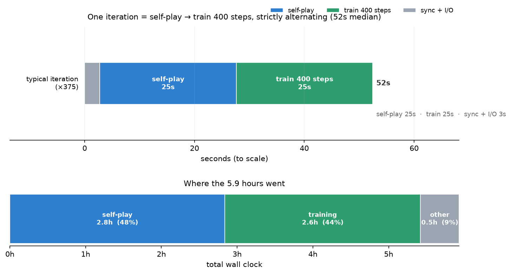
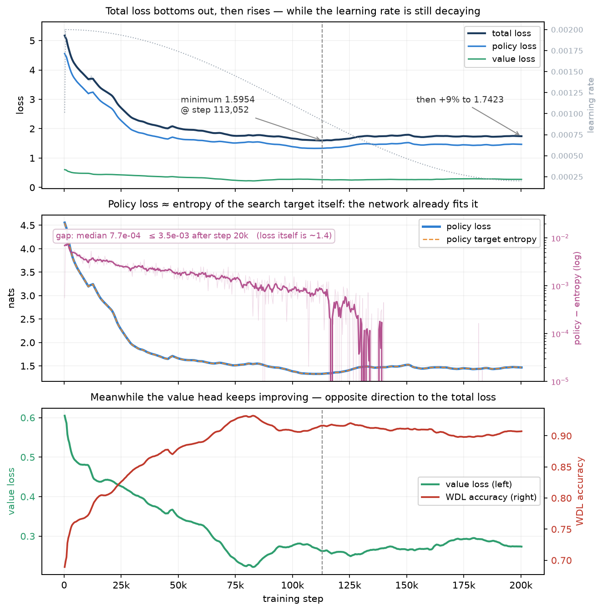
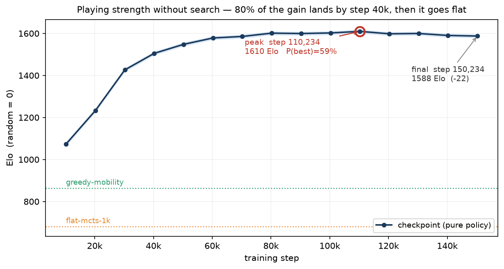

# Cornerstone：Blokus Duo 自博弈模型（FP8 主权重）训练报告

模型结构（CornerNet）与训练方法（Gumbel-AZ 自博弈、稀疏策略目标、克莱因四元群增广
等）与 BF16 那条完全相同，本报告不再重复，见
[BF16 训练报告 §2–§3](BF16训练报告.md#2-模型结构cornernet) 与 `docs/04`。
这里只写 FP8 特有的部分、训练过程、棋力，以及**与 BF16 的头对头**。

---

## 摘要

| | |
|---|---|
| 变量 | 主权重存成 **MXFP8**，随机舍入；其余一切与 BF16 那条对齐 |
| 规模 | **200,252 步 / 501 轮 / 1,076,164 局自博弈** |
| 墙钟 | **44.4 小时**（4×GB200），比 BF16 那条多 20% |
| 棋力 | **纯策略**下最强 **1632 Elo**（步 80,252，锚定 `random = 0`） |
| A/B 结论 | **BF16 更强，+30.6 Elo**（16 对跨腿对局全胜，见 [§5](#5-与-bf16-的头对头)） |

> **口径**：棋力一律是**纯策略**（每手一次前向，落 `argmax(prior)`，不做搜索）。
> 本报告的 Elo 与 BF16 报告的**不在同一次拟合里**，跨报告只看次序；
> 两条腿的强弱以 §5 的头对头为准。

四条主要结论：

1. **BF16 赢了 A/B。** 两边各取最强的 4 档交叉对打 6,400 局，BF16 侧得分率
   **0.5440**，16 对**无一例外**全部由 BF16 胜出，换算 +30.6 Elo
   [+18.7, +42.3]，自举 4000 次里 P(BF16 更强) = 100%。
2. **FP8 的自博弈分布没有塌缩** —— 先手胜率从第 2.5 万步起就稳在 0.83~0.89，
   到终点仍是 0.841，和局率 0.034。而 BF16 那条单调涨到 **0.992**、和局 0.003。
   同一套配置、同一份代码，这是两条腿最大的行为差异。
3. **但没塌缩并没有换来更强。** FP8 同样在**第 8 万步见顶**（BF16 是 9 万步），
   而且此后掉得更多：最后一档比峰值低 **82 分**（BF16 只低 36 分）。
   「分布塌缩导致平台期」这个解释因此**不成立**。
4. **FP8 更慢**：44.4 小时 vs 37.1 小时。自博弈 16.5h vs 9.6h、训练 8.2h vs 6.8h，
   慢的部分全在计算侧。

---

## 1. FP8 主权重

主权重存成 **MXFP8**（E4M3 数据 + E8M0 块缩放，块大小 32），优化器更新时用
**随机舍入**写回。踩过的五个坑与设计取舍见 [`docs/06`](../docs/06-FP8主权重.md)，
这里只列与本次运行直接相关的三条：

- **随机舍入是必须的，不是可选项。** 确定性舍入下，小于半个 ULP 的更新会被永久丢弃，
  学习率退火到后期时几乎所有更新都落在这个范围内 —— 参数会直接冻住。
- **每参数 2.06 字节**。TE 同时保留**行布局与列布局两套数据**（反向的两个 GEMM
  需要不同的连续维，而块缩放的 FP8 没法便宜地转置），所以是
  `2 × (1 + 1/32) ≈ 2.06` 字节，而不是 1.06。对着**纯 BF16 存储**（2 字节）略多，
  但项目里真实的对照是标准混合精度 —— 那条腿的主权重是 **fp32（4 字节）**，
  所以 FP8 实打实省显存：权重 33.9 MB vs 56.7 MB（省 40%），
  连优化器状态一起算省 47%（`docs/06` 有明细）。
- **checkpoint 117.5 MiB**，比 BF16 那条的 162.5 MiB 小 28%。

`fp8_active` 字段在本次运行的 50 次周期检查中**全部为 `true`**
（步 3,852 – 199,852），FP8 计算通路没有发生静默降级。

---

## 2. 训练过程

### 2.1 规模

| | FP8 | BF16 |
|---|---:|---:|
| 步数 / 轮次 | 200,252 / 501 | 200,230 / 501 |
| 自博弈对局 | 1,076,164 | 1,074,512 |
| 墙钟 | **44.4 h** | 37.1 h |
| 训练 | 6.78 步/s | 8.24 步/s |
| 自博弈 | 21.1 局/s（32,230 evals/s） | 34.6 局/s（55,258 evals/s） |

**FP8 慢 20%**，而且慢在计算侧：自博弈 16.5h vs 9.6h、训练 8.2h vs 6.8h。

自博弈慢得尤其多（1.72×），而这**几乎全部来自前向吞吐本身**：
FP8 每秒 32,230 次网络评估、BF16 是 55,258 次，比值 **1.71×** —— 和自博弈耗时比
**1.72×** 吻合到小数点后一位。权重同步（每轮一次、共 501 次）解释不了这个差：
要吃掉那 6.9 小时，每次同步得花 49.6 秒，对 14.2M 参数的反量化+传输+重量化不现实。

（同步确实要走「反量化 → 传普通张量 → 重量化」而不能直接跨卡 `copy_`，
但原因不是量化张量搬不过去 —— 实测 `.to(dev)` 会把 MXFP8Tensor 的四块数据全部
正确搬走。真正的原因是 TE 按**当前 CUDA 设备**取 cuBLAS 句柄，跨卡 `copy_` 必然
有一边不匹配，见 [`docs/06` 第五条](../docs/06-FP8主权重.md)。）

墙钟去向：评测 19.0h（43%）、自博弈 16.5h（37%）、训练 8.2h（18%）、其它 0.7h。
评测这一项和 BF16 那条同因 —— 评测路径当时漏传 `engine_threads`，
在 144 核的机器上单线程跑树搜索（已修，见
[BF16 报告 §7.3](BF16训练报告.md#73-工程教训)）。



### 2.2 损失曲线



总损失在**第 113,052 步**触底（1.5954），之后回升 9% 到 1.7423。
形状和 BF16 那条一致（触底后回升），但绝对值全程更高：

| | FP8 | BF16 |
|---|---:|---:|
| 最低 loss | 1.5954 @ 113k | 1.3039 @ 172k |
| 最终 loss | 1.7423 | 1.4474 |
| 最终 value loss | **0.2747** | 0.0338 |
| 最终 wdl_acc | **0.9069** | 0.9928 |

**value 那两行才是重点。** BF16 的 0.0338 / 0.9928 是「先手赢」这个近乎常数的答案
拿到的分数 —— 好看但没信息量。FP8 的价值头面对的是一个真实的预测问题
（先手胜率只有 0.84、和局 3.4%），所以损失高、准确率低，反而说明它在做事。

`policy` 与 `policy_entropy` 的差值终点是 −1.2e-3（BF16 是 +3.1e-4）——
同样是「策略损失≈目标本身的熵」，网络把自己的搜索分布拟合到位了。
（该字段是按稀疏 top-32 + 尾部质量近似算的，所以会出现极小的负值。）

### 2.3 自博弈分布：没有塌缩

| step | 先手胜率 | 和局率 | 平均手数 |
|---:|---:|---:|---:|
| 252 | 0.540 | 0.015 | 25.3 |
| 25,052 | 0.832 | 0.022 | 30.5 |
| 50,252 | 0.852 | 0.029 | 30.1 |
| 100,252 | 0.832 | 0.026 | 31.2 |
| 150,252 | 0.864 | 0.024 | 30.3 |
| 200,252 | **0.841** | **0.034** | 30.9 |

先手胜率在前 2.5 万步冲到 0.83，此后**十七万五千步里一直在 0.83~0.89 之间摆动**，
终点甚至略有回落。对比 BF16 的 0.55 → 0.992 单调塌缩，这是两条腿最显著的行为差异。

一个未验证的猜测：MXFP8 主权重 + 随机舍入相当于给参数持续注入噪声，
起到了正则化 / 探索的作用，阻止了策略收窄。**这只是假设** ——
要证实需要单独做对照（例如 BF16 主权重上人为加同量级噪声）。

---

## 3. 棋力评测

方法与 BF16 报告 §5 完全一致：20 档 checkpoint（10,252 … 200,252）+ 5 个规则基线
放进**同一场单循环**，全对全 300 对 × 400 局，纯策略、开局随机 2 手且成对
（同一开局双方各执先一次），锚定 `random = 0`，误差按「对」自举。



| checkpoint | Elo | | checkpoint | Elo |
|---|---:|---|---|---:|
| 10,252 | 1259.0 | | 110,252 | 1572.3 |
| 20,252 | 1351.8 | | 120,252 | 1555.6 |
| 30,252 | 1508.7 | | 130,252 | 1551.8 |
| 40,252 | 1589.9 | | 140,252 | 1569.2 |
| 50,252 | 1605.5 | | 150,252 | 1569.0 |
| 60,252 | 1619.3 | | 160,252 | 1543.6 |
| 70,252 | 1631.8 | | 170,252 | 1538.8 |
| **80,252** | **1632.3** | | 180,252 | 1538.1 |
| 90,252 | 1625.6 | | 190,252 | 1542.1 |
| 100,252 | 1602.3 | | 200,252 | 1550.5 |

规则基线（同一次拟合）：`greedy-mobility` 876.9、`flat-mcts-1k` 664.5、
`corner-min` 610.3、`greedy-area` 384.7、`random` 0。

**89% 的增长在前 4 万步**（训练量的 20%）就拿到了。

### 3.1 最强的是哪一档

| checkpoint | Elo | P(是最强) |
|---|---:|---:|
| **80,252** | **1632.3** | **49.5%** |
| 70,252 | 1631.8 | 40.9% |
| 90,252 | 1625.6 | 8.6% |
| 60,252 | 1619.3 | 1.1% |
| 其余 16 档合计 | | 0.0% |

**`step00080252.pt` 名义最强，但只有 49.5% 的把握** —— 真实答案是
「第 6 万到 9 万步之间那 4 档并列」，合计占 100%。和 BF16 一样，
表里的 ±34 是绝对刻度误差，档位之间比较的误差只有 **±8**。

### 3.2 最后一档掉得比 BF16 更多

**`step00200252.pt`（训练终点）排第 13，比峰值低 82 分。**
作为对照，BF16 的终点排第 12、比峰值低 36 分。

也就是说 FP8 在第 8 万步之后的 12 万步训练（占总量的 60%）不但没有提升，
**倒退的幅度还是 BF16 的两倍多**。

---

## 4. 测量的边界

- **纯策略口径**，网络不带搜索。加上搜索会显著更强，但那是另一个口径。
- **绝对刻度靠一条弱边**：纯策略下第 1 万步的网络就把 `flat-mcts-1k` 打成 400:0，
  网络这一块与规则阶梯之间几乎只剩 `greedy-mobility` 那条边。
  可靠的是档位之间的排序（±8），不是绝对值（±34）。
- **Bradley-Terry 假设可传递**，而近实力档位之间存在不可传递性
  （§3.1 里 80,252 对 70,252 的直接头对头其实是 0.486，输的）。
- **单次运行，n=1**。

---

## 5. 与 BF16 的头对头

跨两次拟合的 Elo 不能直接比 —— 对手池一换，规则智能体的 Elo 就能动 20~30 分
（本次实测：`greedy-mobility` 在三次拟合里分别是 877.5 / 876.9 / 898.6）。
而 `docs/06` 本来就规定**棋力结论以头对头胜负为准**。

所以取两边各自 `P(是最强)` 覆盖 ~100% 的**前 4 档**，放进同一场单循环交叉对打：

| BF16 \ FP8 | 80,252 | 70,252 | 90,252 | 60,252 |
|---|---:|---:|---:|---:|
| 90,230 | 0.517 | 0.542 | **0.589** | 0.581 |
| 120,230 | 0.544 | 0.512 | 0.549 | 0.555 |
| 130,230 | 0.549 | 0.530 | 0.556 | 0.554 |
| 100,230 | 0.541 | 0.514 | 0.512 | 0.557 |

（表内为 **BF16 侧的得分率**，>0.5 即 BF16 赢。）

> 顺带排掉一个陷阱：各自拟合里 FP8 的峰值（1632）**看着比** BF16 的峰值（1623）高，
> 但那是两把不同的尺子，比不得。放进同一场之后次序就反过来了 —— 这正是
> 「跨表只看次序、强弱以头对头为准」的现成例子。

**16 对全部由 BF16 胜出，没有一个例外。** 合计 6,400 局，BF16 侧得分率 **0.5440**，
95% 置信区间 [0.5269, 0.5606]，换算 **+30.6 Elo [+18.7, +42.3]**，
4000 次自举里 P(BF16 更强) = **100.0%**。

同一次拟合里的排位也一致 —— BF16 的四档包揽 1~4 名，FP8 的四档是 5~8 名：

| | Elo |
|---|---:|
| net@120230（BF16） | 1707.6 |
| net@90230（BF16） | 1706.1 |
| net@100230（BF16） | 1705.5 |
| net@130230（BF16） | 1705.3 |
| net@70252（FP8） | 1683.4 |
| net@80252（FP8） | 1682.2 |
| net@90252（FP8） | 1675.5 |
| net@60252（FP8） | 1662.3 |

### 结论

**在这次对照里，FP8 主权重换来的是 20% 的额外墙钟和 30.6 Elo 的棋力损失。**

需要注意这不是「FP8 训练不可行」的证据 —— 它跑满了 20 万步、`fp8_active` 全程为真、
增长曲线的形状也正常。它说明的是：**在当前这套超参下**，
MXFP8 主权重带来的数值噪声，其代价（棋力 −30 Elo）大于收益（GEMM 更快，
但被反量化/重量化的同步开销吃掉还倒亏 20% 墙钟）。

---

## 6. 观察与结论

### 6.1 「分布塌缩导致平台期」被证伪

这是本次对照最有价值的结果。BF16 那条的诊断曾经指向自博弈分布塌缩
（先手胜率 → 0.992，价值头在学常数）。FP8 提供了一个天然的反例：
**它的分布全程没有塌缩，却同样在第 8 万步见顶，而且之后掉得更多。**

所以平台期的原因不是（或不只是）分布塌缩。两条腿共有而可能相关的因素还有：
每手只有 64 次模拟、`temperature_plies=12` 相对 30 手的对局偏短、
没有 Dirichlet 噪声这类显式探索项、以及**自博弈的对手永远只有当前的自己**。

### 6.2 两条腿都在训练量的 20% 处基本走完

| | 峰值步数 | 前 4 万步拿到的增长 | 终点相对峰值 |
|---|---:|---:|---:|
| BF16 | 90,230 | 80% | −36 |
| FP8 | 80,252 | 89% | −82 |

**两条腿都是训练到 20% 时就基本到位，之后 80% 的训练是净损耗。**
这个一致性比任何单条腿的曲线都更有说服力。

### 6.3 下一步

按这次数据给出的优先级：

1. **先解决「训练越久越差」，再谈精度选型。** 两条腿都在 20% 处见顶、
   之后倒退 36~82 分。在这个问题解决之前，FP8 与 BF16 差的这 30 分意义有限。
2. **建立能持续区分强弱的量尺。** 规则阶梯在训练走完 5% 时就被打穿了
   （第 1 万步的网络对 `flat-mcts-1k` 已是 400:0），后 95% 的训练没有有效进度信号。
3. **FP8 的同步开销值得单独优化。** 自博弈慢 1.7× 主要来自每轮的
   反量化→传输→重量化。若能改成直接传量化张量，FP8 的墙钟劣势可能反转。
4. **「FP8 噪声起到正则化作用」这个假设值得验证** —— 在 BF16 主权重上人为注入
   同量级噪声，看先手胜率是否同样稳住。这条能把 §2.3 的猜测变成结论。

---

## 7. 复现

```bash
# 起训（四卡）
bash scripts/devbox.sh exec env B_DEVICES=cuda:0,cuda:1,cuda:2,cuda:3 ENGINE_THREADS=128 \
     bash scripts/ab_experiment.sh start-b

# 棋力评测：20 档 + 5 个规则基线单循环，300 对，约 30 分钟
C=../runs/ab-fp8/ckpt
NETS=$(for k in $(seq 10252 10000 200252); do printf "$C/step%08d.pt " $k; done)
bash scripts/devbox.sh exec python3 tools/net_arena.py \
  --rules random greedy-area corner-min greedy-mobility flat-mcts-1k \
  --nets $NETS --games 400 --simulations 0 --engine-threads 128 \
  --out ../runs/arena/fp8_purepolicy.json

bash scripts/devbox.sh exec python3 tools/arena_best.py \
  ../runs/arena/fp8_purepolicy.json --boot 2000 --top 6 \
  --plot reports/图表/FP8棋力曲线.png

# A/B：两边各取最强的 4 档交叉对打
bash scripts/devbox.sh exec python3 tools/net_arena.py \
  --rules random greedy-area corner-min greedy-mobility flat-mcts-1k \
  --nets ../runs/ab-bf16/ckpt/step000{90230,120230,130230,100230}.pt \
         ../runs/ab-fp8/ckpt/step000{80252,70252,90252,60252}.pt \
  --games 400 --simulations 0 --engine-threads 128 \
  --out ../runs/arena/ab_top_purepolicy.json
```

## 8. 附录

| | |
|---|---|
| 最强的一档 | `runs/ab-fp8/ckpt/step00080252.pt` |
| 训练终点 | `runs/ab-fp8/ckpt/step00200252.pt`（排第 13，比峰值低 82 分） |
| 单份大小 | 117.5 MiB（BF16 那条是 162.5 MiB） |
| 训练指标 | `runs/ab-fp8/logs/metrics.jsonl`（501 行） |
| 评测原始数据 | `runs/arena/fp8_purepolicy.json`（300 对）、`runs/arena/ab_top_purepolicy.json`（78 对） |

`runs/` 不进 git，路径列在这里是为了在开发机上能找到原始数据。

| 相关文档 | |
|---|---|
| FP8 主权重的设计与踩坑 | [`docs/06-FP8主权重.md`](../docs/06-FP8主权重.md) |
| 模型结构与训练方法 | [BF16 训练报告 §2–§3](BF16训练报告.md#2-模型结构cornernet) |
| 基线阶梯与 Elo 拟合 | [`docs/03-基线与评测.md`](../docs/03-基线与评测.md) |
